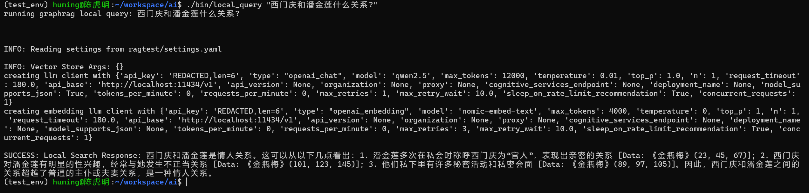
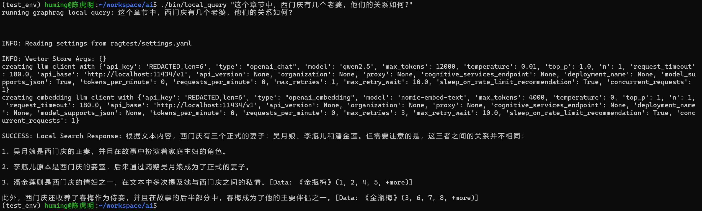
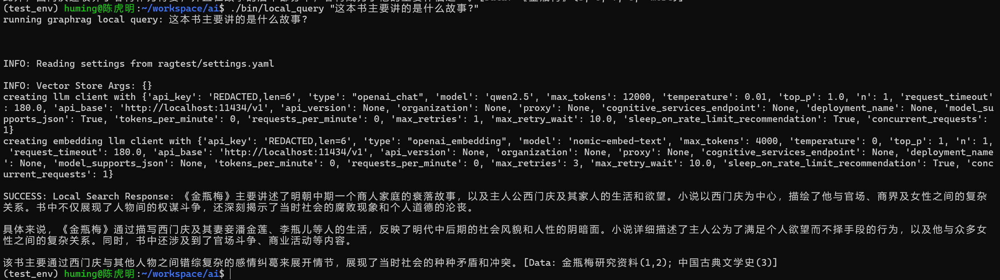
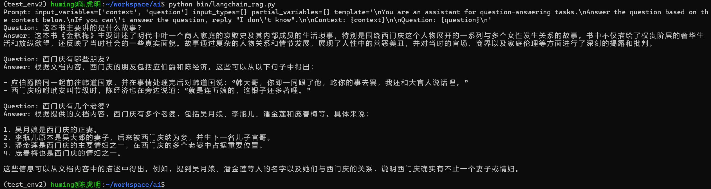

# A bunch of experiments with LLMs

## Setup

0. Install and run Ollama:

```bash
# My GPU is "NVIDIA GeForce RTX 4070 Laptop GPU with 8G VRAM", so I downloaded 7B version models.

~$ mkdir ~/workspace/ai/

~/workspace/ai$ curl -fsSL https://ollama.com/install.sh | sh

~/workspace/ai$ ollama pull mistral
~/workspace/ai$ ollama pull qwen2.5
~/workspace/ai$ ollama pull nomic-embed-text

~/workspace/ai$ mkdir bin

# make sure you have all the scripts placed in ~/workspace/ai/bin

~/workspace/ai$ ./bin/run_ollama
```

1. Create a virtual environment and install the required packages:

```bash
~/workspace/ai$ ./bin/run_ollama python3 -m venv test_env
~/workspace/ai$ source test_env/bin/activate
~/workspace/ai$ pip install -r llm/graphrag/test_env/requirements.txt
```

2. Run GraphRAG to analyze JinPingMei:

```bash
~/workspace/ai$ mkdir ~/workspace/ai/ragtest

# copy llm/graphrag/ragtest to ~/workspace/ai/ragtest

# replace graphrag library with modified_graphrag from mistral/qwen2.5 accordingly

# finetuned extract prompt has been provied, if you want to genenrate by yourself, run ./bin/prompt_tuning

~/workspace/ai$ ./bin/graphrag_index
```

3. Search GraphRAG for JinPingMei questions:

```bash
~/workspace/ai$ ./bin/local_query "这个章节中，西门庆有几个老婆，他们的关系如何?"

# NOTE: global_query is not working is not working due to graphrag codes
```

4. Run normal RAG to analyze and search for JinPingMei：

```bash
~/workspace/ai$ ./bin/run_ollama python3 -m venv test_env
~/workspace/ai$ source test_env/bin/activate
~/workspace/ai$ pip install -r llm/rag/test_env/requirements.txt

~/workspace/ai$ python bin/langchain_rag.py
```

5. Results




