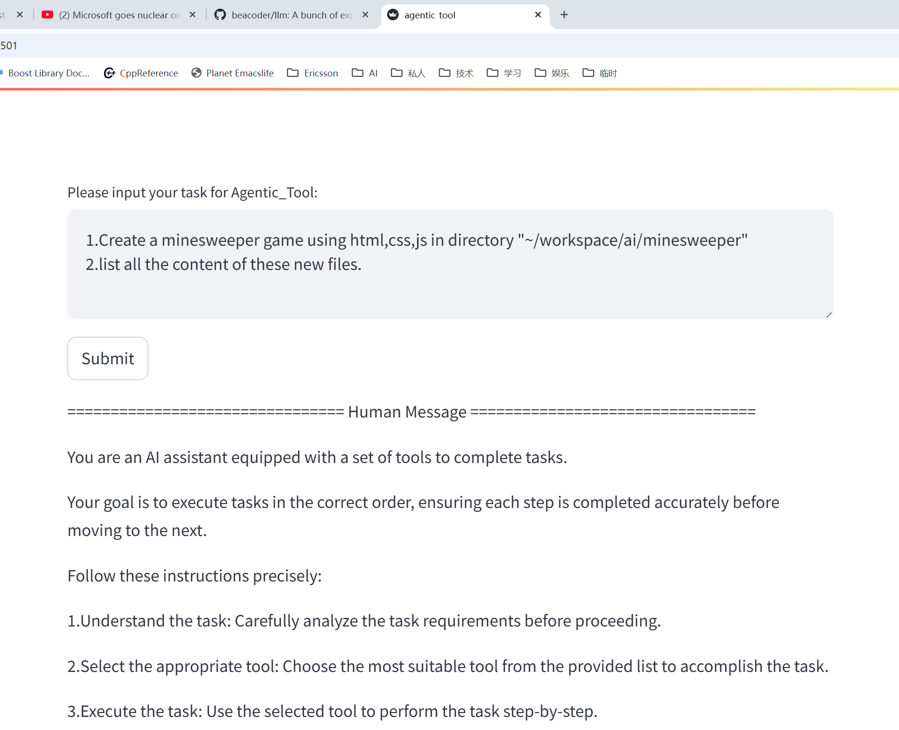
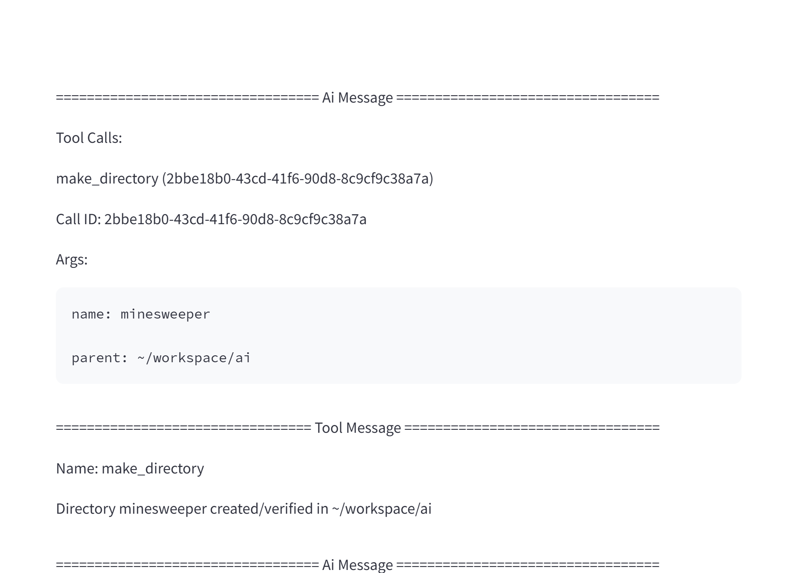
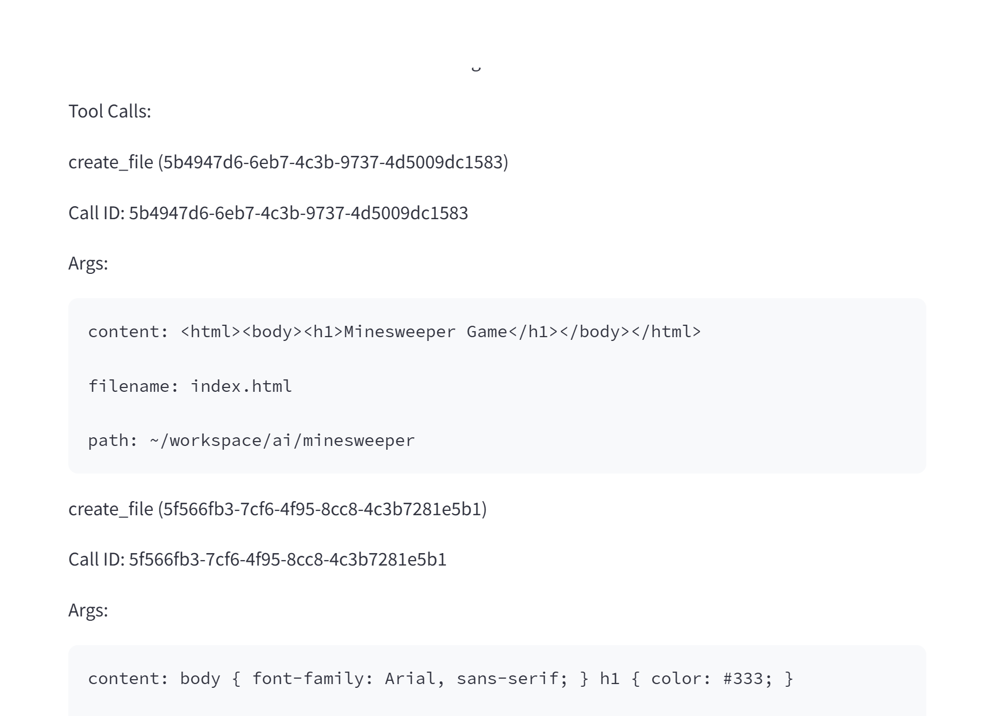
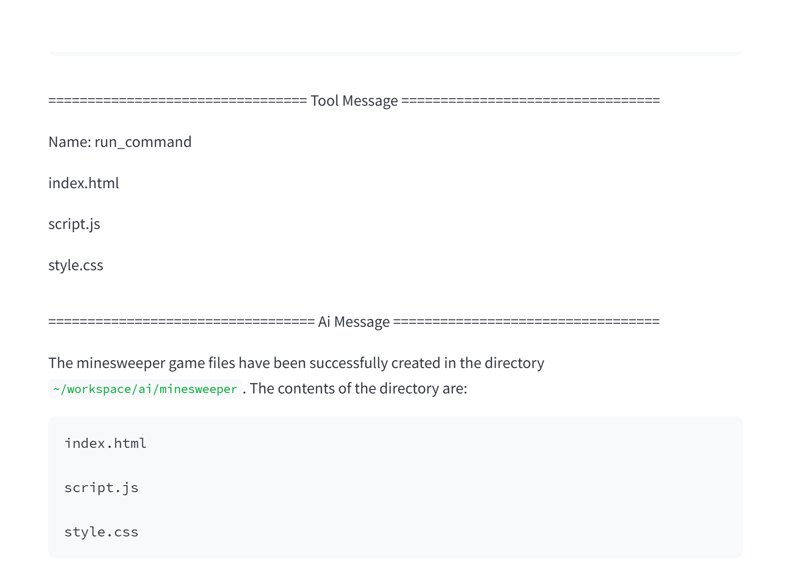

# A bunch of experiments with LLMs

## Build RAG/TOOL application with local LLMs

### Install and run Ollama:

```bash
# My GPU is "NVIDIA GeForce RTX 4070 Laptop GPU with 8G VRAM", so I downloaded 7B version models.

~$ mkdir ~/workspace/ai/

~/workspace/ai$ curl -fsSL https://ollama.com/install.sh | sh

~/workspace/ai$ ollama pull mistral
~/workspace/ai$ ollama pull qwen2.5
~/workspace/ai$ ollama pull nomic-embed-text

~/workspace/ai$ ./ollama/bin/run_ollama
```

### Run AgenticRAG to analyze and search for JinPingMei

```bash
# make sure your python3 version >= 3.10.12

~/workspace/ai$ python3 -m venv rag_env
~/workspace/ai$ source rag_env/bin/activate
~/workspace/ai$ pip install -r rag/requirements.txt

~/workspace/ai$ python ./rag/bin/agentic_rag.py

# NOTE: to be able to handle org file, you have to run "pip install pypandoc-binary"
```

### Run GraphRAG to analyze and search for JinPingMei

```bash
# make sure your python3 version >= 3.10.12

~/workspace/ai$ python3 -m venv graphrag_env
~/workspace/ai$ source graphrag_env/bin/activate
~/workspace/ai$ pip install -r graphrag/requirements.txt

~/workspace/ai$ mkdir ~/workspace/ai/ragtest
~/workspace/ai$ cp -rf graphrag/ragtest ~/workspace/ai/ragtest

# apply changes in modified_graphrag to installed graphrag for mistral/qwen2.5 accordingly
# NOTE: finetuned prompt has been provided, if you wanna do it yourself, run ./bin/prompt_tuning

~/workspace/ai$ ./graphrag/bin/graphrag_index

~/workspace/ai$ ./graphrag/bin/local_query "这个章节中，西门庆有几个老婆，他们的关系如何?"

# NOTE: global_query is not working due to graphrag code broken
```

### Run AgenticTool to experience simple ai-agent

```bash
# make sure your python3 version >= 3.10.12

~/workspace/ai$ python3 -m venv tool_env
~/workspace/ai$ source tool_env/bin/activate
~/workspace/ai$ pip install -r tool/requirements.txt

# support both local_tools and docker_tools.
# for local_tools, tools will be executed on your file system.
# for docker_tools, tools will be executed on docker instance for each user (identified by ip)
# note: for docker_tools, need to run "docker pull python:3.10.12" first
~/workspace/ai$ streamlit run ./tool/bin/agentic_tool.py
```

### Results

```bash
# The model used for these images is qwen2.5, as it's good at Chinese.

# NOTE: The result shows AgenticRAG beats GraphRAG most of the time, strange...
```


```bash
# TOOL task:
# 1.Create a minesweeper game using html,css,js in directory "~/workspace/ai/minesweeper"
# 2.list all the content of these new files.
```




